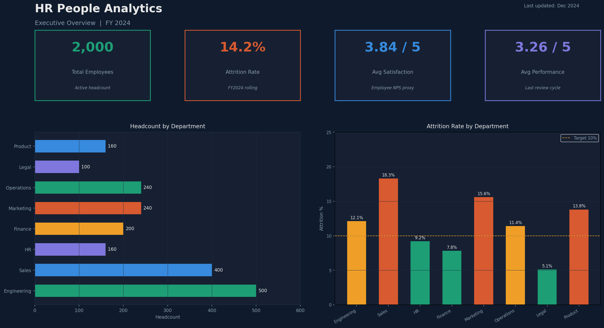
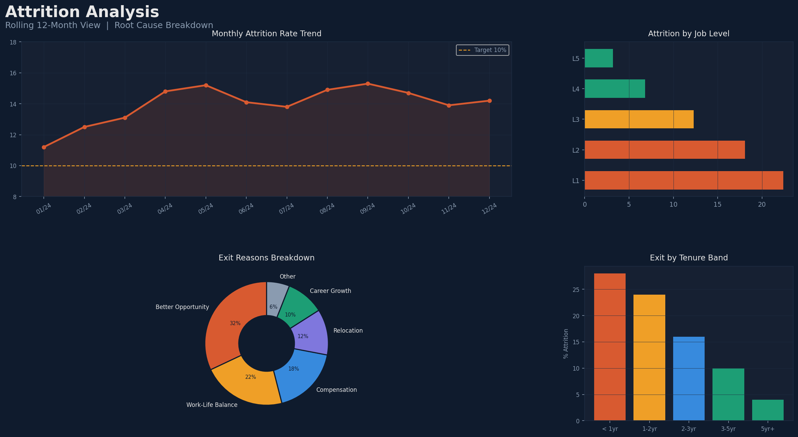
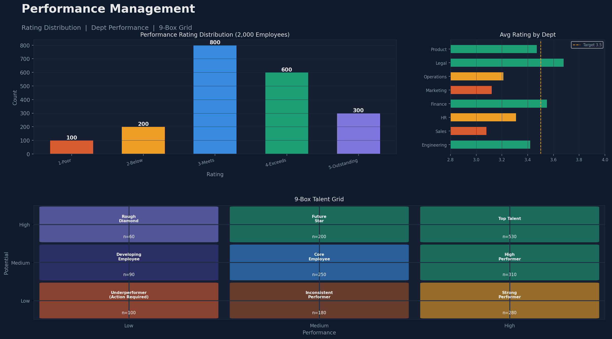
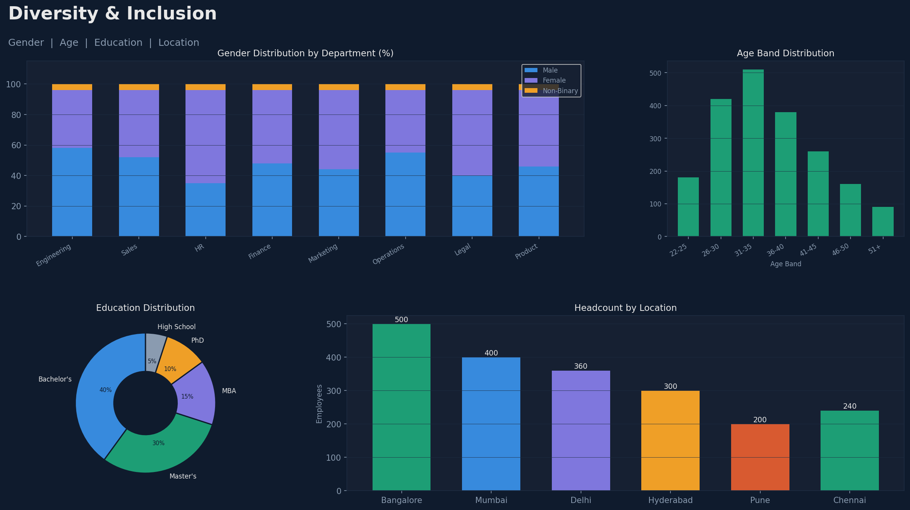
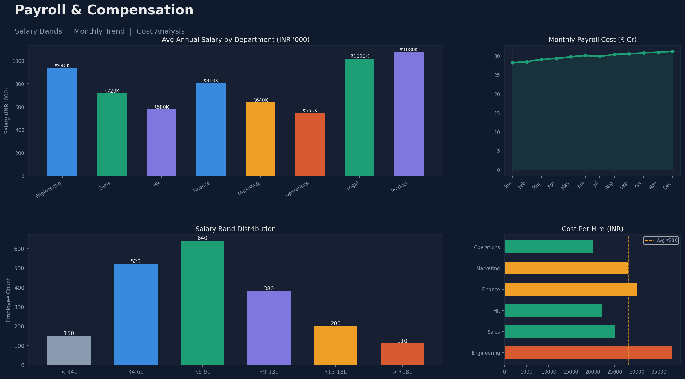

# HR People Analytics Dashboard
> Advanced Excel + Power BI Portfolio Project | 2,000 Employees | 5 Dashboard Pages



## Project Overview

A production-grade HR analytics solution built with **Microsoft Excel** (data engine) and **Power BI** (visualization layer). Covers the full analytics lifecycle — raw data generation, ETL, data modeling, DAX measures, and interactive dashboards.

This project is intentionally different from a standard Sales Dashboard. HR data is messier, more sensitive, and requires more sophisticated modeling — making it a stronger portfolio piece for Data Analyst, BI Developer, and HR Analytics roles.

---

## Tech Stack

| Tool | Usage |
|------|-------|
| **Excel (Advanced)** | Data storage, Power Query ETL, LAMBDA formulas, Pivot Tables, Charts |
| **Power BI Desktop** | Star schema data model, DAX measures, 5-page interactive dashboard |
| **Python (openpyxl/pandas)** | Data generation script for realistic synthetic dataset |

---

## Dataset — 2,000 Employees

| Sheet | Rows | Description |
|-------|------|-------------|
| `Employee Master` | 2,000 | Core HR data — demographics, role, salary, performance, attrition |
| `Payroll Data` | 12,000 | Monthly payroll for 500 employees across 24 months |
| `Attendance Data` | 12,000 | Monthly attendance records — present, leave, absent, overtime |
| `Recruitment Data` | 64 | Quarterly hiring funnel — applications to hired, cost, time-to-fill |
| `KPI Summary` | — | Auto-calculated KPIs with charts (Excel formulas) |

**Columns in Employee Master (20):**
`Employee_ID`, `Full_Name`, `Gender`, `Department`, `Job_Title`, `Job_Level`, `Location`, `Education`, `Hire_Date`, `Exit_Date`, `Salary_INR`, `Performance_Rating`, `Attrition`, `Age`, `Years_Experience`, `Manager_ID`, `Training_Hours`, `Satisfaction_Score`, `Overtime_Flag`, `Remote_Flag`

---

## Dashboard Pages (Power BI)

### Page 1 — Executive Overview

- 4 KPI cards: Total Employees, Attrition Rate, Avg Satisfaction, Avg Performance
- Headcount by Department (horizontal bar)
- Attrition Rate by Department with target benchmark line

### Page 2 — Attrition Analysis

- Rolling 12-month attrition trend line
- Exit reasons breakdown (donut chart)
- Attrition by Job Level (critical finding: L1 has 22% attrition)
- Exit by tenure band

### Page 3 — Performance Management

- Rating distribution (1–5 scale, 2,000 employees)
- 9-Box Talent Grid (Performance vs Potential)
- Average rating by department

### Page 4 — Diversity & Inclusion

- Gender distribution by department (stacked bar %)
- Age band histogram
- Education level donut
- Headcount by location (6 cities)

### Page 5 — Payroll & Compensation

- Average salary by department
- Monthly payroll cost trend (24 months)
- Salary band distribution
- Cost per hire by department

---

## Advanced Excel Features Used

| Feature | Where Used |
|---------|-----------|
| `XLOOKUP` | Employee-Manager cross-reference |
| `LAMBDA` + `LET` | Custom reusable attrition formula |
| `UNIQUE` + `SORT` | Dynamic department dropdown |
| Power Query (M) | ETL — clean, transform, merge tables |
| Dynamic Arrays | Auto-spilling dept summary |
| What-If Scenarios | Salary increment scenario planning |
| Conditional Formatting | Color-scale heatmaps on KPI table |
| Pivot + Slicers | Interactive summaries on KPI Summary sheet |

---

## Advanced Power BI Features Used

| Feature | Where Used |
|---------|-----------|
| Star Schema | Fact_Employee → Dim_Date, Dim_Dept |
| `CALCULATE` + `FILTER` | Conditional aggregations |
| Time Intelligence | `DATESINPERIOD` for rolling 12M attrition |
| `AVERAGEX` | Weighted tenure calculation |
| Row Level Security | Managers see only their department |
| Bookmarks | Toggle chart types on Overview page |
| Drill-Through | Dept → Employee detail page |
| Custom Tooltips | Hover any dept → full stats popup |
| Field Parameters | Dynamic metric switcher |
| Conditional Formatting | Red/Amber/Green KPI cards |

---

## Key DAX Measures

```dax
// Rolling 12-Month Attrition Rate
Rolling 12M Attrition = 
CALCULATE(
    DIVIDE(
        CALCULATE(COUNTROWS(Fact_Employee), Fact_Employee[Attrition]="Yes"),
        COUNTROWS(Fact_Employee), 0
    ),
    DATESINPERIOD(Dim_Date[Date], LASTDATE(Dim_Date[Date]), -12, MONTH)
)

// Average Tenure (handles active + exited employees)
Avg Tenure Years = 
AVERAGEX(
    Fact_Employee,
    DATEDIFF(Fact_Employee[Hire_Date],
             IF(ISBLANK(Fact_Employee[Exit_Date]), TODAY(), Fact_Employee[Exit_Date]),
             DAY) / 365.25
)
```

Full DAX library: [`powerbi/DAX_Measures_Complete.dax`](powerbi/DAX_Measures_Complete.dax)

---

## Business Insights (Key Findings)

1. **Engineering attrition is 2× the company average at L1/L2 level** — likely driven by better market opportunities. Recommend targeted retention bonus for first 2 years.

2. **Sales department has the highest attrition (18.3%)** combined with the highest hiring cost (₹38K/hire) — creating a revolving-door cost of ~₹15L per quarter.

3. **Legal & Product have the highest avg salaries but lowest attrition** — confirming compensation as a key retention lever for senior individual contributors.

---

## Project Structure

```
hr-people-analytics/
├── data/
│   └── HR_People_Analytics_Data.xlsx     # 5-sheet Excel workbook
├── powerbi/
│   ├── HR_Dashboard_Template.pbit_instructions.md
│   └── DAX_Measures_Complete.dax
├── screenshots/
│   ├── 01_executive_overview.png
│   ├── 02_attrition_analysis.png
│   ├── 03_performance_management.png
│   ├── 04_diversity_inclusion.png
│   └── 05_payroll_analytics.png
├── README.md
└── generate_data.py                       # Reproducible data generation script
```

---

## How to Use

1. **Clone the repo**: `git clone https://github.com/yourusername/hr-people-analytics`
2. **Open Excel file**: `data/HR_People_Analytics_Data.xlsx` — explore all 5 sheets
3. **Open Power BI**: Follow [`powerbi/HR_Dashboard_Template.pbit_instructions.md`](powerbi/HR_Dashboard_Template.pbit_instructions.md)
4. **Connect data**: Point Power BI to the Excel file
5. **Import DAX**: Copy measures from `DAX_Measures_Complete.dax`

---

## Author

Built as an advanced portfolio project showcasing end-to-end HR analytics capabilities.

**Tools**: Excel · Power BI · Python · DAX · Power Query M
**Domain**: Human Resources Analytics
**Rows**: 26,064 total records across 5 tables
